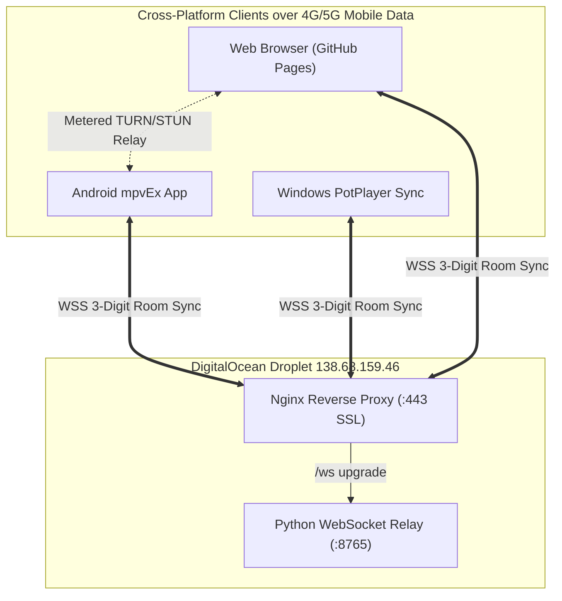

# Project Handover Document — Ultimate Watch Together

**Project Title:** Ultimate Watch Together by Likhon  
**Date:** August 27, 2026  
**Primary Repository:** [likhonmain/Ultimate_Watch_together_by_Likhon](https://github.com/likhonmain/Ultimate_Watch_together_by_Likhon)  
**Android Fork Repository:** [likhonmain/mpvEx](https://github.com/likhonmain/mpvEx)  
**Live Web Application:** [https://likhonmain.github.io/Ultimate_Watch_together_by_Likhon/](https://likhonmain.github.io/Ultimate_Watch_together_by_Likhon/)  
**Release Downloads:** [v1.0.0 Releases](https://github.com/likhonmain/Ultimate_Watch_together_by_Likhon/releases/tag/v1.0.0)  

---

## 1. Executive Summary

**Ultimate Watch Together** is a universal, cross-platform video watch-party ecosystem that enables two or more friends to watch local and streamed movies in microsecond sync across:
1. **Android Phones & Tablets** (via `mpvEx` media player fork)
2. **Windows Desktop** (via Daum PotPlayer integration suite)
3. **Web Browsers / Mobile Web** (via standalone PWA on GitHub Pages)

### The Core Problem Solved
Traditional watch-party tools rely on local LAN/Wi-Fi or require users to type complicated IP addresses (`192.168.x.x` or `10.0.2.2`). When users switch to **4G/5G mobile carrier networks**, symmetric carrier NAT blocks direct inbound peer connections.

**The Solution:**
* **24/7 Cloud WebSocket Relay with SSL** hosted on DigitalOcean (`wss://138-68-159-46.sslip.io/ws`).
* **Zero User Setup:** IP fields are completely removed from all UIs.
* **Unified 3-Digit Room Codes:** A host taps "Create Room" on any device to generate a 3-digit code (e.g., `582`), and friends on any other device type `582` to join.
* **Cellular NAT Keep-Alive:** Dual-layer 15-second heartbeat packets and auto-reconnect logic keep carrier NAT pinholes perpetually open.



---

## 2. Cloud Infrastructure & Operations

### Server Details
* **Provider:** DigitalOcean Droplet
* **Public IPv4:** `138.68.159.46`
* **Domain / SSL:** `138-68-159-46.sslip.io` (Let's Encrypt SSL on Port 443)
* **SSH Access:** `ssh -i C:\Users\Likhon\.ssh\id_ed25519 root@138.68.159.46`
* **Systemd Service:** `watch-together-relay.service`
* **Script Location:** `/root/watch_together_relay.py`
* **Port Mappings:**
  * Port `443` (HTTPS/WSS): Handled by Nginx reverse proxy.
  * Location `/ws`: Proxied to `http://127.0.0.1:8765` with `Upgrade` and `Connection` headers.
  * Port `8765` (WS Fallback): Direct raw WebSocket allowed via UFW (`ufw allow 8765/tcp`).

### Service Commands (Run on Droplet)
```bash
# Check service status
systemctl status watch-together-relay.service

# View live real-time connection and sync logs
journalctl -u watch-together-relay.service -f

# Restart relay service
systemctl restart watch-together-relay.service

# Stop relay service
systemctl stop watch-together-relay.service
```

### Nginx Reverse Proxy Configuration
Location on server: `/etc/nginx/sites-available/telegram-bot`
```nginx
server {
    listen 443 ssl;
    server_name 138-68-159-46.sslip.io;

    ssl_certificate /etc/letsencrypt/live/138-68-159-46.sslip.io/fullchain.pem;
    ssl_certificate_key /etc/letsencrypt/live/138-68-159-46.sslip.io/privkey.pem;

    location /ws {
        proxy_pass http://127.0.0.1:8765;
        proxy_http_version 1.1;
        proxy_set_header Upgrade $http_upgrade;
        proxy_set_header Connection "upgrade";
        proxy_set_header Host $host;
        proxy_set_header X-Real-IP $remote_addr;
        proxy_read_timeout 86400s;
        proxy_send_timeout 86400s;
    }
}
```

---

## 3. Communication Protocol (Harmonized Packets)

The relay server normalizes both standard and legacy packet formats across all three client implementations:

### 1. Room Registration
```json
{
  "type": "join",
  "room": "582",
  "user": "Likhon",
  "platform": "Android (mpvEx)"
}
```
*(Legacy `{"type": "join_room", "room_id": "582", "username": "..."}` is also supported).*

### 2. Playback Synchronization
Both the wrapper action format and direct action format are broadcast to all peers in the room:
```json
{
  "type": "action",
  "room": "582",
  "action": {
    "type": "play",
    "time": 124.50
  },
  "time": 124.50
}
```
Supported action types:
* `play` (with `time` and optional `rate`)
* `pause` (with `time`)
* `seek` (with `time`)
* `rate` (with `rate`, e.g. 1.25)
* `start_watching` (starts playback at 0.0)

### 3. In-Room Chat Messages
```json
{
  "type": "chat",
  "room": "582",
  "chat": {
    "sender": "Likhon",
    "text": "Check out this scene!",
    "time": 1724758000000
  },
  "text": "Check out this scene!",
  "sender_name": "Likhon"
}
```

### 4. 4G/5G Keepalive & NAT Pinhole Retention
* **WebSocket Level:** Ping frames every 15 seconds (`ping_interval=15`).
* **Application Level:** Packet `{"type": "ping"}` returns `{"type": "pong"}`.
* **Android Heartbeat:** Packet `{"type": "heartbeat"}` every 15 seconds.

---

## 4. Component Implementations & Code Locations

### 1. Android mpvEx Client
* **Repository:** `https://github.com/likhonmain/mpvEx` (Branch: `master`)
* **Local Submodule Path:** `D:\Antigravity\Miscellaneous Projects\Ultimate_Watch_together\mpvEx`
* **Key Files:**
  * `app/src/main/java/app/marlboroadvance/mpvex/watchtogether/WatchTogetherManager.kt`: Hardcoded `wss://138-68-159-46.sslip.io/ws` with `ws://138.68.159.46:8765` fallback, OkHttp 15s keepalive ping, 15s heartbeat packet loop, and exponential backoff auto-reconnect (`1s`, `2s`, `4s`, max `10s`).
  * `app/src/main/java/app/marlboroadvance/mpvex/watchtogether/WatchTogetherSheet.kt`: Compose UI without IP field, added "➕ Create Room" (generates `100..999` random code and connects as Host), "Join Room", status pills, and participant count.
* **Build Command:**
  ```powershell
  cd "D:\Antigravity\Miscellaneous Projects\Ultimate_Watch_together\mpvEx"
  .\gradlew.bat assembleStandardDebug
  ```
* **Output APKs:**
  * `Ultimate_Watch_Together_Android_arm64.apk` (64.9 MB)
  * `Ultimate_Watch_Together_Android_Universal.apk` (133.8 MB)

### 2. Windows Daum PotPlayer Client
* **Directory:** `D:\Antigravity\Miscellaneous Projects\Ultimate_Watch_together\potplayer`
* **Key Files:**
  * `potplayer_sync.py`: Win32 window polling via user32 IPC, detects PotPlayer Play/Pause/Seek events, connects to `wss://138-68-159-46.sslip.io/ws`, dark modern Tkinter UI with "➕ Create Room" and "Join Room".
  * `relay_server.py`: Local fallback relay server if offline use is ever needed.
  * `start_potplayer_sync.bat`: One-click batch launcher.
* **How to Run:** Double-click `start_potplayer_sync.bat` (requires Python 3.10+ and `pip install websockets`).
* **Distribution Zip:** `Ultimate_Watch_Together_Windows_PotPlayer.zip`.

### 3. Web Browser PWA Client
* **Directory:** `D:\Antigravity\Miscellaneous Projects\Ultimate_Watch_together\browser`
* **Key Files:**
  * `js/sync.js`: Dual-stack engine combining PeerJS WebRTC (with Google STUN & Metered TURN `turn:global.relay.metered.ca:80`) and Cloud WebSocket Relay (`wss://138-68-159-46.sslip.io/ws`).
  * `js/app.js`: Connects to room from UI or URL param (`?room=XXX`), enables "Start Watching Together" if either WebRTC peers or Cloud Relay peers exist.
  * `js/player.js`: Video engine with YouTube Vanced virtual environment (Stevens' acoustic volume curve V^2.2, non-destructive dark scrim overlay for brightness).
  * `js/chat.js`: Real-time chat with audio chime and unread badge.
* **Live Deployment:** Automatically deployed to GitHub Pages on every commit via `.github/workflows/deploy-pages.yml`.
* **Distribution Zip:** `Ultimate_Watch_Together_Web_Browser.zip`.

---

## 5. Maintenance & Troubleshooting Guide

### How to Verify the Cloud Relay from Any Machine
Run in PowerShell (requires Python with `websockets`):
```powershell
py -3.13 -c "import asyncio, websockets, json
async def test():
    async with websockets.connect('wss://138-68-159-46.sslip.io/ws') as ws:
        await ws.send(json.dumps({'type': 'join', 'room': '999', 'user': 'Tester'}))
        res = await ws.recv()
        print('Relay Response:', res)
asyncio.run(test())"
```
**Expected Output:**
`Relay Response: {"type": "room_joined", "room_id": "999", "client_id": "...", "peer_count": 1}`

### How to Update Relay Code on the Droplet
```bash
# 1. SSH into the server
ssh -i C:\Users\Likhon\.ssh\id_ed25519 root@138.68.159.46

# 2. Edit the relay script
nano /root/watch_together_relay.py

# 3. Restart the service
systemctl restart watch-together-relay.service

# 4. Check status
systemctl status watch-together-relay.service
```

### How to Update GitHub Pages
Any changes pushed to `browser/` on branch `main` automatically trigger GitHub Actions and deploy to GitHub Pages within 25 seconds.
```powershell
cd "D:\Antigravity\Miscellaneous Projects\Ultimate_Watch_together"
git add browser/
git commit -m "Update web browser client"
git push origin main
```

### How to Re-upload or Update Release Assets
```powershell
cd "D:\Antigravity\Miscellaneous Projects\Ultimate_Watch_together"
gh release upload v1.0.0 Ultimate_Watch_Together_Android_arm64.apk Ultimate_Watch_Together_Android_Universal.apk Ultimate_Watch_Together_Windows_PotPlayer.zip Ultimate_Watch_Together_Web_Browser.zip --clobber --repo likhonmain/Ultimate_Watch_together_by_Likhon
```

---

## 6. Repository Summary

| Resource | URL |
| :--- | :--- |
| **Main Repository** | [https://github.com/likhonmain/Ultimate_Watch_together_by_Likhon](https://github.com/likhonmain/Ultimate_Watch_together_by_Likhon) |
| **Android Submodule** | [https://github.com/likhonmain/mpvEx](https://github.com/likhonmain/mpvEx) |
| **Live GitHub Pages** | [https://likhonmain.github.io/Ultimate_Watch_together_by_Likhon/](https://likhonmain.github.io/Ultimate_Watch_together_by_Likhon/) |
| **Release v1.0.0** | [https://github.com/likhonmain/Ultimate_Watch_together_by_Likhon/releases/tag/v1.0.0](https://github.com/likhonmain/Ultimate_Watch_together_by_Likhon/releases/tag/v1.0.0) |
| **Cloud Relay WebSocket** | `wss://138-68-159-46.sslip.io/ws` |
