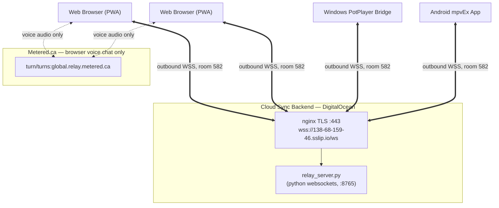

# Project Handover Document — Ultimate Watch Together

**Project Title:** Ultimate Watch Together by Likhon  
**Date:** August 27, 2026  
**Primary Repository:** [likhonmain/Ultimate_Watch_together_by_Likhon](https://github.com/likhonmain/Ultimate_Watch_together_by_Likhon)  
**Android Fork Repository:** [likhonmain/mpvEx](https://github.com/likhonmain/mpvEx)  
**Live Web Application:** [https://likhonmain.github.io/Ultimate_Watch_together_by_Likhon/](https://likhonmain.github.io/Ultimate_Watch_together_by_Likhon/)  
**Release Downloads:** [v1.0.0 Releases](https://github.com/likhonmain/Ultimate_Watch_together_by_Likhon/releases/tag/v1.0.0)  

> **Sync protocol:** the authoritative wire format and every sync rule live in
> [PROTOCOL.md](PROTOCOL.md). This document covers architecture, builds and
> operations. If the two ever disagree, PROTOCOL.md is correct.

---

## 1. Executive Summary & Ecosystem Architecture

**Ultimate Watch Together** is a cross-platform watch-party ecosystem that lets two or
more friends watch local and streamed movies in tight synchronisation across:

1. **Android Phones & Tablets** — via the `mpvEx` media player fork
2. **Windows Desktop** — via the Daum PotPlayer bridge
3. **Web Browsers / Mobile Web** — via the standalone PWA on GitHub Pages

### The Core Problem Solved

Traditional watch-party tools rely on LAN/Wi-Fi or make users type IP addresses
(`192.168.x.x`). On **4G/5G mobile networks**, symmetric Carrier-Grade NAT (CGNAT)
blocks inbound peer-to-peer traffic outright, so a direct connection between two
phones on mobile data generally cannot be established at all.

**The solution — one cloud WebSocket relay, no peer-to-peer for sync.** Every client
makes a single *outbound* WSS connection to a room on the relay. Outbound TLS on port
443 works on every carrier and behind every corporate firewall, so NAT type stops
mattering entirely.

* **Zero local setup:** no local server, no IP addresses, no port forwarding.
* **Unified 3-digit room codes:** the host taps "Create Room" on any device to get a
  3-digit code (e.g. `582`); friends on any other platform enter `582`.
* **WebRTC is voice only.** Metered.ca TURN/STUN is used *exclusively* for the
  browser's optional voice chat. It carries no playback sync. This is a deliberate
  change — running sync over both a relay and a data channel is what used to make
  every action apply two or three times.



---

## 2. Backend Infrastructure

### 2.1 Sync relay (all playback sync + chat)

| Item | Value |
| :--- | :--- |
| **Primary endpoint** | `wss://138-68-159-46.sslip.io/ws` |
| **Fallback endpoint** | `ws://138.68.159.46:8765` (plain ws, for networks that break TLS) |
| **Server source** | `potplayer/relay_server.py` |
| **Role** | Room registry + dumb message fan-out. It holds **no playback state.** |

The relay keeps a `room code → set of client sockets` map and forwards messages to
everyone in the room except the sender. Clients rotate to the fallback endpoint **only
when the handshake itself fails** — a drop after a healthy session retries the same
URL, because bouncing between endpoints on every disconnect was itself a bug.

Because the relay overwrites `sender_id` / `sender_name` / `platform` on every
forwarded frame, clients must never trust those fields for identity. Identity lives in
the client-set `sid` / `sname` / `splat` fields instead.

> **The deployed server is still the older v1 build.** `relay_server.py` in this repo has
> since gained permissive (blocklist) forwarding, a `peers[]` list on `room_joined`, and a
> `sid` on `peer_left` — see [PROTOCOL.md §9](PROTOCOL.md). Redeploying is **optional**;
> all three clients are written to work either way, and every one of those additions is
> treated as optional on the receiving side.

### 2.2 Metered.ca TURN/STUN (browser voice chat only)

* **STUN:** `stun:stun.relay.metered.ca:80`, `stun:stun.l.google.com:19302`
* **TURN:** `turn:global.relay.metered.ca:80`, `turn:global.relay.metered.ca:80?transport=tcp`,
  `turns:global.relay.metered.ca:443?transport=tcp`
* **Username:** `1cf2d79f96fff8c808bf9920` · **Credential:** `mBOMO6wq0kfXKWgP`

PeerJS ids are `uwt-voice-<code>-<sid>` — namespaced per client, so a stale id can no
longer collide with the room code and produce the old `unavailable-id` /
"Host room not found" failures.

---

## 3. Communication Protocol (v2 — summary)

Full spec in [PROTOCOL.md](PROTOCOL.md). The essentials:

Every peer message is wrapped in `type: "action"`, because that is what the deployed
relay's forwarding allowlist already accepts — **v2 needs no server redeploy.** The
real message type is `kind`.

```json
{
  "type": "action",
  "room": "582",
  "v": 2,
  "kind": "state",
  "sid": "a7f3k9x2q",
  "sname": "Likhon",
  "splat": "android",
  "seq": 412,
  "sent_at": 1756300000123,
  "position": 124.5,
  "paused": false,
  "rate": 1.0,
  "duration": 7241.0,
  "cause": "seek"
}
```

| Field | Purpose |
| :--- | :--- |
| `v` | Must be `2`. Anything else is dropped, structurally. |
| `sid` | Stable per-process id. **Rule 1: a packet whose `sid` is ours is never applied.** |
| `seq` | Monotonic per sender. **Rule 2: `seq <= last_seen` is a replay and is dropped** (with a 50-step tolerance so a restarted counter still works). |
| `sent_at` | Sender's wall clock, used with the NTP-style offset estimate for latency compensation. |
| `kind` | `state`, `chat`, `hello`, `bye`, `request_state`, `tping`, `tpong`, `file_info`. |
| `cause` | Why a `state` was sent: `play`, `pause`, `seek`, `rate`, `resync`, `heartbeat`. |

**Playback sync is state based, never event based.** There are no `play`/`pause`/`seek`
messages — only absolute `state` (position + paused + rate). A lost, late or duplicated
packet therefore cannot leave the room skewed; the next state simply overwrites it.

The elected leader (`(isHost ? "0:" : "1:") + sid`, lowest wins) re-broadcasts state
every 3 s to repair drift. Heartbeats are gated four ways on the receiver so drift
repair can never fight a user action.

Echo suppression is a **timestamp deadline**, not a boolean flag — nested or rapid
applies can only extend the mute window, never unmute each other early. This is what
removed the "stuck in a loop" symptom.

Keep-alive: a relay-level `{"type":"ping"}` every 15 s keeps mobile carrier NAT tables
from expiring during long pauses; a `hello` every 10 s keeps peer presence fresh
(25 s timeout).

---

## 4. Platform Component Implementations

### 4.1 Android mpvEx Client

* **Repository:** `https://github.com/likhonmain/mpvEx` (branch `master`), submodule at `mpvEx/`
* **Files:**
  * `watchtogether/WatchTogetherModel.kt` — v2 packet model, `ClockEstimate`. Note that
    `state` always serialises `position`/`paused`/`rate`/`duration`, including at `0.0`
    and `1.0`; omitting them at their defaults used to make receivers jump to the start
    of the file.
  * `watchtogether/WatchTogetherManager.kt` — the whole sync engine: generation-guarded
    reconnect, one 500 ms ticker for all periodic work, seq/echo rejection, clock
    estimation, leader election, chat store.
  * `watchtogether/WatchTogetherSheet.kt` — room management: display name, Create Room,
    3-digit-only Join, copy-code button, participant count, chat.
  * `watchtogether/WatchTogetherChatOverlay.kt` — **in-player chat.** Collapsed 44 dp
    bubble with an unread badge, expanding to a 300 dp panel. Renders nothing when not
    in a room.
  * `ui/player/PlayerViewModel.kt` — bridges mpv to the manager. Broadcasts come from the
    mpv `pause` / `speed` **property observers**, not from UI call sites, so every path
    that changes playback is covered exactly once.
  * `ui/player/PlayerActivity.kt` — the five lifecycle pause sites (screen off, audio
    focus loss, backgrounding, finishing) call `pauseLocalOnly()`, so locking your phone
    no longer pauses the movie for everyone else.
* **Build:**
  ```powershell
  cd "D:\Antigravity\Miscellaneous Projects\Ultimate_Watch_together\mpvEx"
  .\gradlew.bat assembleStandardDebug
  ```
  Outputs land in `mpvEx/app/build/outputs/apk/standard/debug/`.

  > **Gotcha:** `mpvEx/local.properties` must be saved **without a UTF-8 BOM.** A BOM
  > makes Gradle read the key as `\uFEFFsdk.dir` and the build fails with
  > "SDK location not found" even though the path is correct.
* **Packaged binaries:** `Ultimate_Watch_Together_Android_arm64.apk`,
  `Ultimate_Watch_Together_Android_Universal.apk` (both debug-signed, so they install
  directly with no keystore).

### 4.2 Windows Daum PotPlayer Client

* **Directory:** `potplayer/`
* **`potplayer_sync.py`** — drives PotPlayer over Win32 `SendMessage` IPC
  (`WM_USER + 0x5002/0x5004/0x5005/0x5006/0x5007`), polling every 250 ms. A jump away
  from where natural playback would have landed (>1.2 s) is treated as a seek; a status
  change is a play/pause. Both broadcast absolute state.
  * PotPlayer's documented message set has **no playback-rate accessor**, so this client
    always reports `rate: 1.0` and ignores remote rate changes.
  * Seek tolerances are looser than the browser's (0.80 s explicit / 1.50 s heartbeat)
    because PotPlayer seeks by keyframe and thrashes at 0.30 s.
* **`start_potplayer_sync.bat`** — one-click launcher.
* **Requirements:** Python 3.10+ and `pip install websockets`.
* **Distribution zip:** `Ultimate_Watch_Together_Windows_PotPlayer.zip`

### 4.3 Web Browser PWA Client

* **Directory:** `browser/`
* **`js/sync.js`** — the `SyncEngine`: relay transport, v2 packets, seq/echo rejection,
  clock estimation, leader heartbeat, chat, presence. Owns the room code.
* **`js/voice.js`** — PeerJS/WebRTC **voice only**, ids namespaced `uwt-voice-<code>-<sid>`.
* **`js/player.js`** — applies absolute remote state; local events broadcast through one
  chokepoint.
* **`js/app.js`** — UI wiring, 3-digit validation, `?room=582` auto-join.
* **`js/chat.js`** — chat UI, notification sound, unread badge.
* **Cache busting:** asset query strings in `index.html` are at `?v=4.0`. **Bump these on
  every browser change** or returning users keep the old JS.
* **Deployment:** pushes to `browser/` on `main` auto-deploy to GitHub Pages via
  `.github/workflows/deploy-pages.yml`.
* **Distribution zip:** `Ultimate_Watch_Together_Web_Browser.zip`

---

## 5. Maintenance & Verification Guide

### 5.1 Is the relay up?

Open the PWA in two browser tabs, create a room in one and join that code in the other,
then confirm the participant count reaches 2. If the relay is down, both clients report
"Reconnecting in Ns" and rotate to `ws://138.68.159.46:8765`.

To probe the endpoint directly — a healthy relay answers with `room_joined`:

```bash
python - <<'EOF'
import asyncio, json, websockets
async def main():
    async with websockets.connect("wss://138-68-159-46.sslip.io/ws") as ws:
        await ws.send(json.dumps({"type": "join_room", "room": "999", "username": "probe"}))
        print(await asyncio.wait_for(ws.recv(), 5))
asyncio.run(main())
EOF
```

To run the relay locally instead of using the cloud one:

```bash
python potplayer/relay_server.py
```

### 5.2 Diagnosing a sync problem

In order, because these are the three things that have actually gone wrong:

1. **Is every client on v2?** A v1 client is silently ignored — there is deliberately no
   compatibility shim. Check that the browser is not serving cached JS (bump `?v=`).
2. **Are both peers seeing each other?** The participant count comes from `hello`
   packets. If it says 1, the packets are not being forwarded — check the room code
   matches exactly, including all three digits.
3. **Is one peer fighting the other?** Watch the logs for repeated seeks in opposite
   directions. Only the leader should emit `cause: "heartbeat"`.

### 5.3 Verifying Metered TURN (voice chat only)

1. Open the [WebRTC Trickle ICE tester](https://webrtc.github.io/samples/src/content/peerconnection/trickle-ice/).
2. Add `turn:global.relay.metered.ca:80`, username `1cf2d79f96fff8c808bf9920`,
   password `mBOMO6wq0kfXKWgP`.
3. Gather candidates and confirm `relay` candidates appear with `Done` status.

A TURN failure breaks **voice only**. Playback sync and chat keep working.

### 5.4 Updating the web client

```bash
git add browser/ && git commit -m "Update web browser client" && git push origin main
```

### 5.5 Updating release binaries

```bash
gh release upload v1.0.0 Ultimate_Watch_Together_Android_arm64.apk Ultimate_Watch_Together_Android_Universal.apk Ultimate_Watch_Together_Windows_PotPlayer.zip Ultimate_Watch_Together_Web_Browser.zip --clobber --repo likhonmain/Ultimate_Watch_together_by_Likhon
```

---

## 6. Known Limitations

* **Room codes are 3 digits (100–999) and unauthenticated.** That is 900 rooms in one
  public namespace, so a stranger who guesses your code joins your room. This is a
  deliberate, accepted trade-off for a friends-only tool.
* **PotPlayer cannot sync playback rate** (no Win32 message for it); it reports and holds
  1.0×.
* **No v1 compatibility.** All three clients must be updated together.
* **Media is not distributed.** Everyone needs their own copy of the file, or a shared
  stream URL. The suite syncs playback, not video.

---

## 7. Repository & Resource Links

| Resource | URL |
| :--- | :--- |
| **Main Repository** | [likhonmain/Ultimate_Watch_together_by_Likhon](https://github.com/likhonmain/Ultimate_Watch_together_by_Likhon) |
| **Android Submodule** | [likhonmain/mpvEx](https://github.com/likhonmain/mpvEx) |
| **Live Web App** | [likhonmain.github.io/Ultimate_Watch_together_by_Likhon](https://likhonmain.github.io/Ultimate_Watch_together_by_Likhon/) |
| **Release Downloads** | [v1.0.0](https://github.com/likhonmain/Ultimate_Watch_together_by_Likhon/releases/tag/v1.0.0) |
| **Sync Relay** | `wss://138-68-159-46.sslip.io/ws` (fallback `ws://138.68.159.46:8765`) |
| **Voice TURN Backend** | `global.relay.metered.ca` (80 UDP/TCP, 443 TLS) |
| **Protocol Spec** | [PROTOCOL.md](PROTOCOL.md) |
