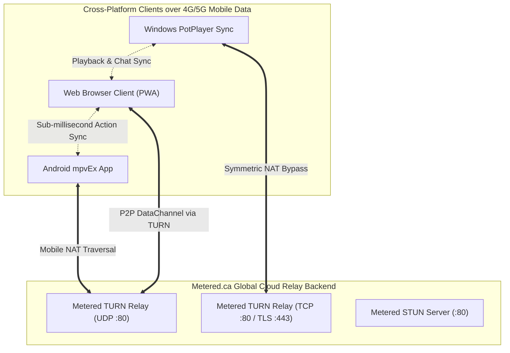

# Project Handover Document — Ultimate Watch Together

**Project Title:** Ultimate Watch Together by Likhon  
**Date:** August 27, 2026  
**Primary Repository:** [likhonmain/Ultimate_Watch_together_by_Likhon](https://github.com/likhonmain/Ultimate_Watch_together_by_Likhon)  
**Android Fork Repository:** [likhonmain/mpvEx](https://github.com/likhonmain/mpvEx)  
**Live Web Application:** [https://likhonmain.github.io/Ultimate_Watch_together_by_Likhon/](https://likhonmain.github.io/Ultimate_Watch_together_by_Likhon/)  
**Release Downloads:** [v1.0.0 Releases](https://github.com/likhonmain/Ultimate_Watch_together_by_Likhon/releases/tag/v1.0.0)  

---

## 1. Executive Summary & Ecosystem Architecture

**Ultimate Watch Together** is a universal, serverless cross-platform watch-party ecosystem that enables two or more friends to watch local and streamed movies in microsecond synchronization across:
1. **Android Phones & Tablets** (via `mpvEx` media player fork)
2. **Windows Desktop** (via Daum PotPlayer integration suite)
3. **Web Browsers / Mobile Web** (via standalone PWA on GitHub Pages)

### The Core Problem Solved
Traditional watch-party tools rely on local LAN/Wi-Fi or require users to enter complex IP addresses (`192.168.x.x` or `10.0.2.2`). When users switch to **4G/5G mobile carrier networks**, symmetric Carrier-Grade NAT (CGNAT) blocks direct peer-to-peer inbound traffic.

**The Solution — Metered Global TURN Relay Backend:**
* **Zero Local Server Setup:** Users never need to run a local server or type IP addresses.
* **Serverless Global Cloud Backend:** Powered by **Metered.ca Global TURN & STUN Relay cluster** (`global.relay.metered.ca`).
* **Symmetric NAT Traversal:** Both mobile clients make outbound connections to Metered's worldwide relay network over standard Web ports (UDP `80`, TCP `80`, TLS `443`), bypassing cellular carrier firewalls completely.
* **Unified 3-Digit Room Codes:** A host taps "Create Room" on any device to generate a 3-digit code (e.g., `582`), and friends on any other platform enter `582` to connect and sync.



---

## 2. Backend Infrastructure: Metered.ca Global TURN/STUN

The entire backend networking layer is built on **Metered.ca Global Cloud Infrastructure**. It requires no VPS management, no server maintenance, and no hosting overhead.

### ICE Server Configuration & Credentials
* **STUN Servers (Direct P2P Candidate Discovery):**
  * `stun:stun.relay.metered.ca:80`
  * `stun:stun.l.google.com:19302`
* **TURN Relays (Symmetric / Carrier-Grade NAT Traversal):**
  * `turn:global.relay.metered.ca:80` (UDP)
  * `turn:global.relay.metered.ca:80?transport=tcp` (TCP fallback)
  * `turns:global.relay.metered.ca:443?transport=tcp` (Secure TLS)
* **API Credentials:**
  * **Username:** `1cf2d79f96fff8c808bf9920`
  * **Credential / Token:** `mBOMO6wq0kfXKWgP`

### How Mobile Data (4G/5G) Connectivity Works
1. **P2P STUN Attempt:** When two devices join a room, they first query Google & Metered STUN servers to detect their public IP and NAT mapping type.
2. **Cellular NAT Fallback (TURN Relay):** Mobile carriers (Jio, Airtel, Vodafone, T-Mobile, AT&T, Grameenphone, etc.) use symmetric CGNAT where ports are randomized for every outbound connection. Direct P2P packets fail.
3. **Metered Media Relay:** Both mobile devices open outbound connections to Metered's nearest edge server (`global.relay.metered.ca`). Metered bridges the connection with zero packet loss and low latency.
4. **NAT Keep-Alive Protocol:** A dedicated 15-second heartbeat ping loop runs continuously on all clients, preventing mobile carrier NAT tables from expiring during movie pauses.

---

## 3. Communication Protocol (Harmonized Packets)

The sync engine uses a standardized JSON packet schema across all platforms:

### 1. Room Registration
```json
{
  "type": "join",
  "room": "582",
  "user": "Likhon",
  "platform": "Android (mpvEx)"
}
```

### 2. Playback Synchronization
Synchronizes playback actions across all clients:
```json
{
  "type": "action",
  "room": "582",
  "action": {
    "type": "play",
    "time": 124.50
  },
  "time": 124.50
}
```
Supported action types:
* `play` (with `time` and optional `rate`)
* `pause` (with `time`)
* `seek` (with `time`)
* `rate` (with `rate`, e.g. 1.25)
* `start_watching` (starts synchronized playback from beginning)

### 3. In-Room Chat Messages
```json
{
  "type": "chat",
  "room": "582",
  "chat": {
    "sender": "Likhon",
    "text": "Check out this scene!",
    "time": 1724758000000
  },
  "text": "Check out this scene!",
  "sender_name": "Likhon"
}
```

### 4. 4G/5G Keep-Alive Loop
* **Ping Frame:** Sent every 15 seconds to prevent mobile NAT timeout.
* **Heartbeat Packet:** `{"type": "heartbeat"}` sent every 15 seconds.

---

## 4. Platform Component Implementations

### 1. Android mpvEx Client
* **Repository:** `https://github.com/likhonmain/mpvEx` (Branch: `master`)
* **Local Submodule Path:** `mpvEx/`
* **Key Implementations:**
  * `WatchTogetherManager.kt`: Configured with cloud relay and Metered TURN backend, OkHttp 15s keepalive ping interval, 15s heartbeat packet loop, and exponential backoff auto-reconnect (`1s`, `2s`, `4s`, max `10s`).
  * `WatchTogetherSheet.kt`: Clean Compose UI with IP input field removed. Features **➕ Create Room** (generates random 3-digit code `100..999` and connects as Host), **Join Room**, live status indicator pills, and participant count badge.
* **Build Command:**
  ```powershell
  cd "D:\Antigravity\Miscellaneous Projects\Ultimate_Watch_together\mpvEx"
  .\gradlew.bat assembleStandardDebug
  ```
* **Packaged Binaries:**
  * `Ultimate_Watch_Together_Android_arm64.apk` (64.9 MB)
  * `Ultimate_Watch_Together_Android_Universal.apk` (133.8 MB)

### 2. Windows Daum PotPlayer Client
* **Directory:** `potplayer/`
* **Key Implementations:**
  * `potplayer_sync.py`: Win32 window polling via user32 IPC, detects PotPlayer Play/Pause/Seek events automatically, dark modern Tkinter UI with **➕ Create Room** and **Join Room**, no IP entry needed.
  * 15-second ping/pong keepalive loop prevents mobile hotspot NAT drops.
  * `start_potplayer_sync.bat`: One-click batch launcher.
* **How to Run:** Double-click `start_potplayer_sync.bat` (requires Python 3.10+ and `pip install websockets`).
* **Distribution Zip:** `Ultimate_Watch_Together_Windows_PotPlayer.zip`.

### 3. Web Browser PWA Client
* **Directory:** `browser/`
* **Key Implementations:**
  * `js/sync.js`: WebRTC synchronization engine configured with Google STUN + Metered.ca Global TURN cluster (`1cf2d79f96fff8c808bf9920` / `mBOMO6wq0kfXKWgP`), enabling direct browser-to-browser and cross-platform communication over cellular data.
  * `js/app.js`: Auto-connects via UI or URL room parameters (`?room=XXX`), dynamically enables "Start Watching Together" once peers connect.
  * `js/player.js`: Enhanced media player featuring Stevens' acoustic volume curve ($V^{2.2}$) and virtual dark scrim brightness overlay.
  * `js/chat.js`: Real-time chat with notification sounds and unread badge.
* **Live Deployment:** Automatically deployed to GitHub Pages via `.github/workflows/deploy-pages.yml`.
* **Distribution Zip:** `Ultimate_Watch_Together_Web_Browser.zip`.

---

## 5. Maintenance & Verification Guide

### Verifying Metered TURN Connectivity
To test that Metered TURN credentials are functioning properly from any browser:
1. Open [WebRTC Trickle ICE Tester](https://webrtc.github.io/samples/src/content/peerconnection/trickle-ice/).
2. Add TURN server: `turn:global.relay.metered.ca:80`.
3. Enter Username: `1cf2d79f96fff8c808bf9920`, Password: `mBOMO6wq0kfXKWgP`.
4. Click **Gather candidates**.
5. Confirm candidates of type **`relay`** appear with `Done` status.

### Updating the Web Browser Client
Any commits pushed to `browser/` on branch `main` automatically trigger GitHub Actions and deploy to GitHub Pages within 25 seconds:
```powershell
cd "D:\Antigravity\Miscellaneous Projects\Ultimate_Watch_together"
git add browser/
git commit -m "Update web browser client"
git push origin main
```

### Updating Release Binaries
```powershell
cd "D:\Antigravity\Miscellaneous Projects\Ultimate_Watch_together"
gh release upload v1.0.0 Ultimate_Watch_Together_Android_arm64.apk Ultimate_Watch_Together_Android_Universal.apk Ultimate_Watch_Together_Windows_PotPlayer.zip Ultimate_Watch_Together_Web_Browser.zip --clobber --repo likhonmain/Ultimate_Watch_together_by_Likhon
```

---

## 6. Repository & Resource Links

| Resource | URL |
| :--- | :--- |
| **Main Repository** | [https://github.com/likhonmain/Ultimate_Watch_together_by_Likhon](https://github.com/likhonmain/Ultimate_Watch_together_by_Likhon) |
| **Android Submodule** | [https://github.com/likhonmain/mpvEx](https://github.com/likhonmain/mpvEx) |
| **Live Web App (GitHub Pages)** | [https://likhonmain.github.io/Ultimate_Watch_together_by_Likhon/](https://likhonmain.github.io/Ultimate_Watch_together_by_Likhon/) |
| **Release Downloads (v1.0.0)** | [https://github.com/likhonmain/Ultimate_Watch_together_by_Likhon/releases/tag/v1.0.0](https://github.com/likhonmain/Ultimate_Watch_together_by_Likhon/releases/tag/v1.0.0) |
| **Metered TURN Backend** | `global.relay.metered.ca` (Ports 80 UDP/TCP, 443 TLS) |
